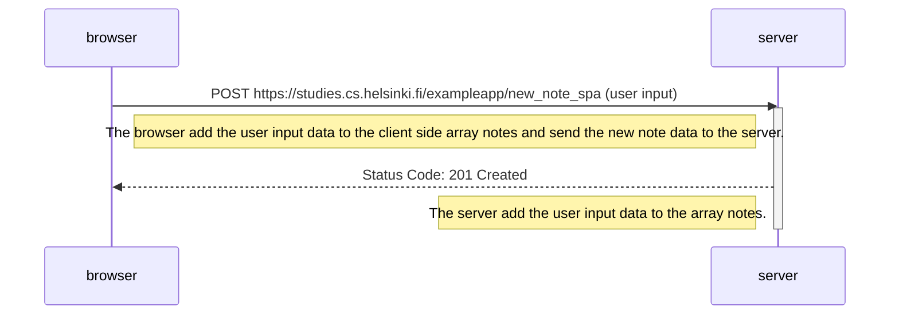

```mermaid
sequenceDiagram
    participant browser
    participant server

    browser->>server: POST https://studies.cs.helsinki.fi/exampleapp/new_note_spa (user input)
    activate server
     Note right of browser: The browser add the user input data to the client side array notes and send the new note data to the server.
    server-->>browser: Status Code: 201 Created
     Note left of server: The server add the user input data to the array notes.
    deactivate server

```
